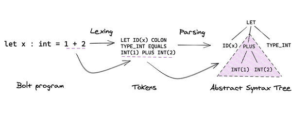

# Pseudo-Compiler

An sml based project that parses, checks types and evaluates a limited-scope programming language.

Part of assignments for the course COL226: Programming Languages in second semester 2021, IIT Delhi.

## Problem Statements

The problem statements corresponding to these assignments can be found here: [assignment2](ProblemStatements/statement1.pdf) and [assignment3](ProblemStatements/statement1.pdf).

## Details of the compiler

The compiler was built to lex, parse, type-check and evaluate a language very similar to sml. The scope was constrained to consider only integer, boolean and string operations. 

1. Supports integer, boolean and string data types
2. Supports simple arithmetic (NEGATE, +, -, x) and boolean operations (AND, NOT, OR, XOR)
3. Suports if...then...else...fi type conditional statements
4. Supports let...in...end type declaration function
2. Supports simple one argument functions

## Implementation Explanation

A compiler can roughly be divided into 3 main stages: Lexer/Parser, Type-Checker/Evaluator and Intermediate Representation generator. In this repository, the first two stages are built for a limited scope language of boolean and arithmetic operations. 

### Lexer/Parser

In simple terms, the lexer effectively goes through the entire program and creates "tokens" (key words, variables, numbers etc.). The tokens can be of a set of different types and this set of tokes defines the syntax rules of the language. The lexer converts a program file into a sequence of tokens, which can be processed further by the parser.

   
  The first stage: Lexer/Parser

The parser then processes this sequence of tokens to generate the parse tree and the abstract syntax tree. The next stage of Type-checker/Evaluator works using the abstract syntax tree provided by the parser.

### Type-checker/Evaluator

The type checker verifies the type-based sytactic rules of the language. This limited scope language is strictly typed, with no implicit type casting enabled. So `bool = 5` would throw an error in type checking.

After the type-checker's checks have passed, the program is evaluated. Using lookup tables to get variable values and other methods, the value of each statement of the program is evaluated!

## Instructions for use

Clone the repo, go into the src directory and then, `make run`.

More detailed instructions can be found inside the src directory [readme](src/README.md).
